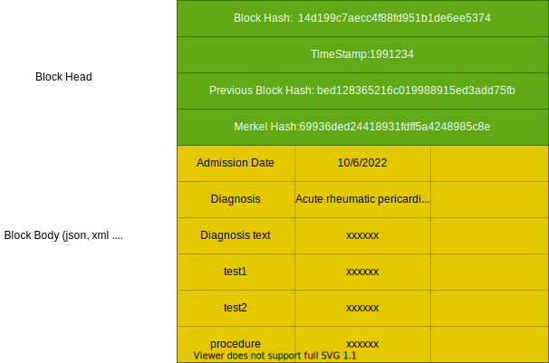

# Block Chain Electronic Health Records

Description: Vanilla version of electronic health record on private block chain.

Tools Pack: Java, Maven, Spring Boot

Created on: Jul 1 2022

## 1. Project Introduction 

### 1.1 Overview

Proportional hazards models(Cox Model) are a class of survival models in statistics, it is widely applied in insurance pricing model and public health analysis. A major strength of Cox Model is its ability to encompass time-dependent covariates, that is the covariates change over time. According to [Cabral, Howard J.](https://doi.org/10.1186/s12874-016-0248-6) , time-dependent method has more promising result than other non time-dependent methods. In public health research, investigating the chronically order of patients records is extremely helpful for understanding patient clinical status, to accomplishing this, researchers need to spend lots of time on data cleaning and sorting, it is a huge challenge for those who are not familiar with database and data cleaning tools. Another problem is ,due to the protection of patient privacy, obtaining personal health records is extremely hard for insurers and researchers. Even though they can access to these records, it cannot contain the capacity of big data which means a huge obstacle for model training and data-driven analysis. A decent solution to these problems is to develop a system that organizing the health records in the form of block chain and providing API for users. Since not only the owner of the chain can access to it, the authenticity of data matters, we need to make sure the records on the system cannot be tampered once they are uploaded. That is why we decided to use the structure of block chain.

Let me introduce a little bit background of block chain before we dive into some specific details, as Satoshi Nakamoto suggested on his passage [Bitcoin: A Peer-to-Peer Electronic Cash System](https://bitcoin.org/bitcoin.pdf)，transactions can be stored on the distributed ledgers using block chain technology.  This revolutionary design is called block chain and the transaction ledger is the famous Bitcoin. The block chain technology then be modified and developed to become extensible and customizable which can maintain the transactions records immutable and execute smart contract -- a set of pre-defined rules for transactions. Combined with the need for a better way of organizing health record data for conducting research and secure data sharing method for broader collaboration with commercial organizations ,especially with Insurance Companies, we have our new idea of health records system -- Block Chain Electronic Health Records.

Block chain technology is pretty mature and robust nowadays,we only have to make some minor modification on it to meet our business requirements.

The System includes applications below:

1. Consortium block chains (行業區塊鏈)
2. Researcher Interface

     -  Data cleaning and records traversing.
     -  Verified portal for paper data reproducing.
     -  Built-in Analysis Algorithm
3. Insurers Interface

   - Built-in Pricing Model or Customized Model
   - Group Risk Monitoring

Multiple organizations share the responsibilities of maintaining the block chain. The chain is not visible to any other organizations than the chain members. It provides API to Researcher and Insurers to implement sophisticated and data-driven models without any possibility of leaking individual information but still holding the capacity of enormous data, the encryption algorithm and consensus mechanism ensures the authenticity of the records and data safety.

For the technical issues, we mainly focus on the block structure, communication between members in the consortium block chain,  consensus mechanism and application interface.

##  2. Data Layer

To the contrary of the public property of traditional block chain, health records need more exclusive membership, that means the system only remain  accessible to a certain group of organizations such as Hospital Unions, Hospital Authority and Universities. The chain remains invisible to other organizations.

Every block memorize the previous block hash, it points to the previous block. Since the blocks are generated on chronological order, the chain can present the time relationship very clearly.

The structure of block chain:

### 2.1  Block Structure

For every single block, it has head and meta data, the meta data stores of all the information of a single visit to hospital of a single patient, for example, it can record the admission date, lab test date and result, diagnosis record, prescriptions and so on. The head of every block contains:

- Self block hash: the hash value of all the text fields except for itself 
- Previous block hash: the hash value of father block
- Time stamp: records the birth time of this block
- Merkle root: the hash value of all the text record of this block

### 2.2 Cryptography

## 3. Network

###  3.1 Peer-to-peer Network

###  3.2 Broadcast Mechanism

###  3.3 Verification Mechanism

## 4. Consensus Mechanism

## 5. Application Interface

### 5.1 Researcher

#### 5.1.1 Peer-review Interface

#### 5.1.2 Data pipeline

#### 5.1.3 Built-in Model

### 5.2 Insurers

###

